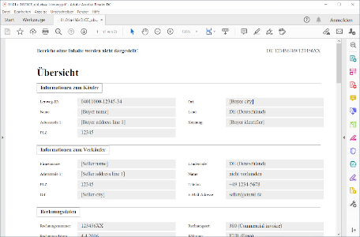
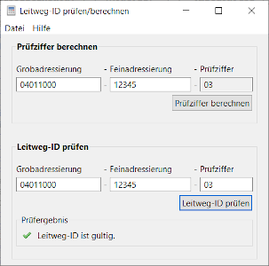
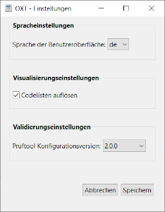

## OpenXRechnungToolbox

			

			  
1 / 6

			  
			  
Hauptfenster

			

			

			  
2 / 6

			  
			  
Prüfbericht

			

			

			  
3 / 6

			  
			  
Visualisierung

			

			

			  
4 / 6

			  
			  
PDF-Visualisierung

			

			

			  
5 / 6

			  
			  
Leitweg-ID-Rechner/-Prüfer

			

			

			  
6 / 6

			  
			  
Einstellungen

			

 

   
   
   
   
   
   

Die OpenXRechnungToolbox (OXT) bietet eine graphische Benutzeroberfläche zu den mit dem Standard XRechnung herausgegebenen Tools (Prüftool, Visualisierung) und fügt ergänzend noch ein paar weitere Funktionalitäten hinzu (Codelistenauflösung für die Visualisierung, Leitweg-ID-Rechner/-Prüfer, Nutzung für Peppol-Rechnungen). Damit macht sie die XRechnungs-Tools für Nicht-Programmierer nutzbar. 

### Funktionalitäten auf einen Blick

- **Erzeugung einer menschenlesbare Visualisierung** von XRechnungs-Dateien, inkl. optionaler Codelisten-Auflösung, inkl. Speicherfunktion als HTML-Datei sowie Erzeugung einer PDF-Visualiserung; auch für andere Rechnungsinstanzen nutzbar, die konform zur Europäischen Norm EN16931 sind (z.B. Peppol BIS 3.0)
- **Technische Validierung** von XRechnungs-Dateien sowie Peppol BIS 3.0 Rechnungen, verfügbar für verschiedene XRechnungs-Versionen, inkl. Speicherfunktion des Prüfberichts als HTML-Datei
- Berechnung und Prüfung von **Leitweg-ID-Prüfziffern**

### Vorteile gegenüber vielen anderen Angeboten

- **Sie geben Ihre Daten nicht aus der Hand**: kein Hochladen von Rechnungsdateien auf einen Server; reine lokale Desktop-Anwendung (Datenschutz)
- **Sie bleiben jederzeit anonym**: keine Registrierung oder sonstige Nutzer*inneninformationen erforderlich (Datenschutz)
- **Ihnen rückt kein Vertrieb auf den Leib**: kein kommerzielles Interesse
- **Sie besitzen vollständige digitale Souveränität**: offener Quellcode (Open Source), somit vollständige Nachvollziehbarkeit und Weiterentwicklungsmöglichkeit

### Wer steckt dahinter

Die OpenXRechnungToolbox wurde von Jan C. Thiele entwickelt. Dr. Dr. Jan C. Thiele ist hauptberuflich Referent und stv. Referatsleiter beim Senator für Finanzen der Freien Hansestadt Bremen. Er ist einer der Autoren des Standards XRechnung, hat das EU-Projekt "Peppol E-Invoicing für Government in Germany" (PeGGy) für Bremen durchgeführt und ist Vertreter Bremens im Steuerungskreis von XRechnung. 
Zuvor hat er als wissenschaftlicher Mitarbeiter der Universität Göttingen in verschiedenen Projekten (betriebliche) Informationssysteme, insb. Entscheidungsunterstützungssysteme im Umweltbereich, entworfen und entwickelt. Ein Schwerpunkt seiner wissenschaftlichen Tätigkeit war die simulationsbasierte Entscheidungsunterstützung. 
Die OpenXRechnungToolbox ist ein Freizeitprojekt und steht in keinem direkten Zusammenhang mit dem Senator für Finanzen. 
Als Open Source Software ist jede(r) eingeladen zur Weiterentwicklung der Software beizutragen. 

### Weitere Infos

Das Benutzerhandbuch etc. ist [hier](https://jcthiele.github.io/OpenXRechnungToolbox/docs/manual.html "Benutzerhandbuch") zu finden.

### Kontakt

Wenn Sie Kontakt aufnehmen wollen, Lob oder Optimierungshinweise mitteilen möchten, dann wenden Sie sich bitte mit Ihrem Anliegen an: <a href="mailto:openxrechnungtoolbox@gmx.net">openxrechnungtoolbox@gmx.net</a>.

### Download

Das jeweils aktuelle Release ist [hier](https://github.com/jcthiele/OpenXRechnungToolbox/releases) erhältlich.

Der Quellcode wird im [GitHub Repository](https://github.com/jcthiele/OpenXRechnungToolbox) gepflegt. 
 
 
(Master branch)
